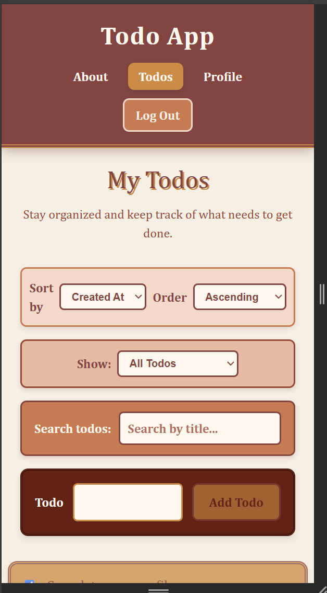

# Todo List App

A responsive React todo-list application built with Vite. The application allows authenticated users to create, edit, complete, delete, search, sort, and filter todos. It also includes protected routes, a profile page with todo statistics, an about page, and a custom 404 page.

## Features

* User authentication and logout
* Protected todo and profile routes
* Add, edit, complete, and delete todos
* Client-side todo title validation
* Maximum length limits for todo titles
* Search todos by title
* Sort todos by title or creation date
* Filter todos by active or completed status
* URL-based filtering with query parameters
* Profile statistics
* Loading, error, and empty states
* Responsive design
* Custom 404 page
* Accessible focus states and touch-friendly controls

## Technologies Used

* React
* Vite
* JavaScript
* CSS
* React Router

## Screenshots

### Todos Page

The Todos page allows authenticated users to manage their tasks, including adding, editing, completing, deleting, searching, sorting, and filtering todos.


### Profile Page

The Profile page displays user information and statistics based on the user's todo activity.


### Mobile View



## Getting Started

### Prerequisites

Before installing the project, make sure you have the following installed:

* [Node.js](https://nodejs.org/)
* npm
* Git

### Installation

1. Clone the repository:

```bash
git clone https://github.com/ArtfulArtie/todo-list.git
```

2. Open the project folder:

```bash
cd todo-list
```

3. Install the project dependencies:

```bash
npm install
```

4. Start the development server:

```bash
npm run dev
```

5. Open the local development URL provided by Vite in your browser.

## Available Scripts

### `npm run dev`

Starts the Vite development server for local development.

### `npm run build`

Creates an optimized production build of the application.

### `npm run preview`

Previews the production build locally.

### `npm run lint`

Runs ESLint to check the codebase for JavaScript and React code-quality issues.

## Application Structure

The application is organized into reusable React components and feature-based folders.

* `src/features/` — Feature-specific components and functionality
* `src/pages/` — Application pages and route-level components
* `src/shared/` — Reusable components shared across the application
* `src/utils/` — Utility functions such as todo validation
* `src/contexts/` — React context used for application-wide state such as authentication

## Authentication and Routing

The application uses protected routes to prevent unauthenticated users from accessing private pages.

Authenticated users can access:

* `/todos`
* `/profile`

Public pages include:

* `/`
* `/about`
* `/login`

The application also includes a custom 404 page for routes that do not exist.

When an unauthenticated user attempts to access a protected route, the application redirects them to the login page. After authentication, the intended destination can be preserved so the user can continue where they left off.

Todo status filtering can also be represented through URL query parameters, allowing filtered views to be accessed directly through a URL.

## Input Validation

Todo titles are validated on the client before they are added or updated.

The validation prevents:

* Empty todo titles
* Titles containing only whitespace
* Todo titles longer than 100 characters

The input fields also use a maximum length of 100 characters to prevent users from entering unnecessarily long values before submission.

## Design Decisions

The application uses a warm, earthy color palette to create a cozy and approachable visual identity. This choice was made to capture the warmth and cozy nature of autumn.

Reusable React components organize the navigation, todo form, todo list, filtering, sorting, and authentication functionality.

Protected routes prevent unauthenticated users from accessing private pages. React state is used for todo interactions, while URL query parameters support status-based filtering.

The project uses global CSS for shared application styling and a CSS Module for navigation-specific styles. This keeps the overall layout consistent while allowing selected component styles to remain scoped.

The application also includes loading, error, and empty states to provide users with clear feedback while interacting with the application.

## Accessibility and Responsive Design

The application was designed with usability and accessibility in mind.

* Visible focus states help users navigate interactive elements.
* Buttons and controls are sized for comfortable touch interaction.
* Form inputs use associated labels.
* The layout adapts to different screen sizes.
* Empty and error states provide clear feedback to users.

## Future Improvements

Possible future improvements include:

* Add due dates and reminders
* Add todo categories or tags
* Add priority levels
* Add automated tests
* Add improved keyboard support for editing
* Add deployment configuration
* Add user profile customization
* Add additional accessibility testing

## Live Demo

Deployment to Vercel is optional for this assignment. This project is not currently deployed.


## Video Demonstration

A video demonstration is included with the assignment submission to demonstrate the application's main functionality, including authentication, todo management, filtering, sorting, and navigation.

## License

This project is licensed under the MIT License.


## Contact

* GitHub: https://github.com/ArtfulArtie
* LinkedIn: https://www.linkedin.com/in/artfulartie/
